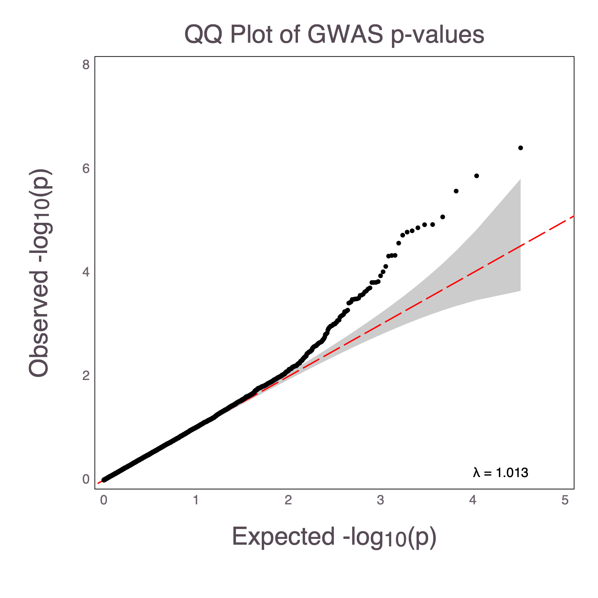

# MendelPlots

| **Documentation** | **Build Status** | **Code Coverage**  |  **Citation**  |
|-------------------|------------------|--------------------|--------------------|
| [](https://OpenMendel.github.io/MendelPlots.jl/stable) [](https://OpenMendel.github.io/MendelPlots.jl/latest) | [](https://travis-ci.org/OpenMendel/MendelPlots.jl) | [](https://coveralls.io/github/OpenMendel/MendelPlots.jl?branch=master) [](https://codecov.io/gh/OpenMendel/MendelPlots.jl) |  [](https://zenodo.org/badge/latestdoi/161412002) |


MendelPlots.jl is a Julia package for generating common plots from results of genome-wide association studies (GWAS). It can currently create Manhattan Plots and QQ Plots. 

**MendelPlots** is a plotting and data visualization system written in [Julia](http://julialang.org/). It uses [Gadfly](https://github.com/GiovineItalia/Gadfly.jl) as the backend, which is influenced by Grammar of Graphics Style programming and Hadley Wickham's [ggplot2](http://ggplot2.org/)


This package is registered in the default Julia package registry, and can be installed through standard package installation procedure: e.g., running the following code in Julia REPL.
```julia
using Pkg
pkg"add MendelPlots"
```

## Citation

If you use [OpenMendel](https://openmendel.github.io) analysis packages in your research, please cite the following reference in the resulting publications:

*OPENMENDEL: a cooperative programming project for statistical genetics. Zhou H, Sinsheimer JS, Bates DM, Chu BB, German CA, Ji SS, Keys KL, Kim J, Ko S, Mosher GD, Papp JC, Sobel EM, Zhai J, Zhou JJ, Lange K. Hum Genet. 2019 Mar 26. doi: 10.1007/s00439-019-02001-z. [Epub ahead of print] PMID: 30915546*


## Package features

- Creates publication quality plots in PNG format


## Contributing and Request Plots

The software is relatively new. [File an
issue](https://github.com/OpenMendel/MendelPlots.jl/issues/new) to report a
bug or request a feature.





